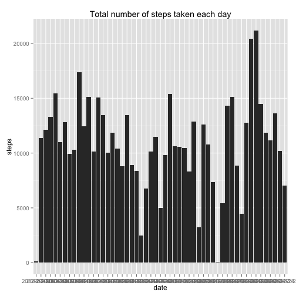
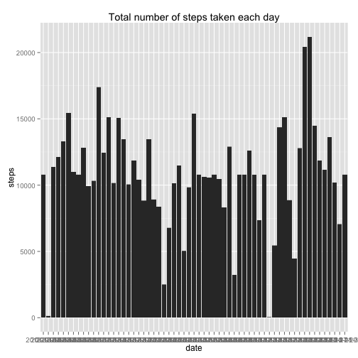
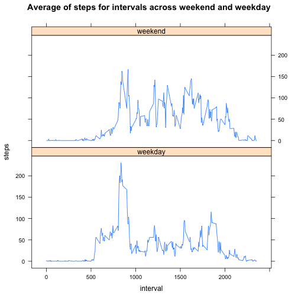

This is an R Markdown document for Reproducible Research Assignment 1


```r
#Loading and preprocessing the data
activity <- read.csv(unz("./activity.zip","activity.csv"))

#What is mean total number of steps taken per day?
library(ggplot2)
```

```
## Loading required package: methods
```

```r
sum_each_day <- aggregate(. ~date, data = activity, FUN= sum)
qplot(date, steps, data = sum_each_day, geom = "histogram", stat = "identity", main = "Total number of steps taken each day")
```

 

```r
print("Mean total number of steps taken per day:")
```

```
## [1] "Mean total number of steps taken per day:"
```

```r
print(mean(sum_each_day$steps))
```

```
## [1] 10766.19
```

```r
print("Median total number of steps taken per day:")
```

```
## [1] "Median total number of steps taken per day:"
```

```r
print(median(sum_each_day$steps))
```

```
## [1] 10765
```

```r
#What is the average daily activity pattern?
avg_activity <- aggregate(. ~interval, data = activity[,c(1,3)], FUN= mean)
plot(avg_activity$interval, avg_activity$steps, type = "l", main="Average number of steps taken")
```

 

```r
print("5 minute interval, in which maxium number steps taken:")
```

```
## [1] "5 minute interval, in which maxium number steps taken:"
```

```r
print(avg_activity[which.max(avg_activity$steps),]$interval)
```

```
## [1] 835
```

```r
print("Total number of missing value:")
```

```
## [1] "Total number of missing value:"
```

```r
print(nrow(activity[is.na(activity$steps),]))
```

```
## [1] 2304
```

```r
#Imputing missing values
#split activity into 2 frames. one only includes NA rows, the other one has all value filled.
na_activity<- activity[is.na(activity$steps),]
no_na_activity<- activity[!is.na(activity$steps),]

#join interval average with the NA frame
filled_na_activity<- merge(na_activity, avg_activity, by="interval" )
#remove NA column
filled_na_activity<- filled_na_activity[,c(1,3,4)]
names(filled_na_activity)<-c("interval","date","steps")
#merge Non NA frame with filled activity
filled_activity<- rbind(no_na_activity,filled_na_activity )
#order by date and interval, filled_activity is the new dataset that is equal to the original dataset but with the missing data filled in 
filled_activity <- filled_activity[order(filled_activity[,2], filled_activity[,3]),]

qplot(date, steps, data = filled_activity, geom = "histogram", stat = "identity", main = "Total number of steps taken each day")
```

 

```r
sum_each_day_filled <- aggregate(. ~date, data = filled_activity, FUN= sum)
print("Mean total number of steps taken per day:")
```

```
## [1] "Mean total number of steps taken per day:"
```

```r
print(mean(sum_each_day_filled$steps))
```

```
## [1] 10766.19
```

```r
print("Median total number of steps taken per day:")
```

```
## [1] "Median total number of steps taken per day:"
```

```r
print(median(sum_each_day_filled$steps))
```

```
## [1] 10766.19
```

```r
print("Since the filled value comes from average value for each interval and NA was not included in caculation, it didn't impact much on average. However, since the order of interval step total number changed, median get affected.")
```

```
## [1] "Since the filled value comes from average value for each interval and NA was not included in caculation, it didn't impact much on average. However, since the order of interval step total number changed, median get affected."
```

```r
#Are there differences in activity patterns between weekdays and weekends?

identifyDate<-function(dt)
{
        if(weekdays(as.Date(dt)) == "Sunday"|weekdays(as.Date(dt)) == "Saturday")
        {
                return("weekend")
        }
        else{
                return("weekday")
        }
}

filled_activity_weekdays<-cbind(filled_activity, sapply(filled_activity$date, identifyDate))
names(filled_activity_weekdays)[4]<-"weekdays"
avg_filled_activity_weekdays<- aggregate(.~weekdays+interval, data = filled_activity_weekdays, FUN= mean)
library(lattice)
xyplot(steps~ interval | weekdays, data = avg_filled_activity_weekdays, type = "l", layout = c(1,2), main = "Average of steps for intervals across weekend and weekday")
```

 
